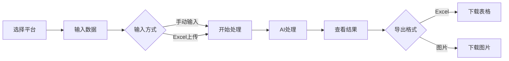

# 产品优化助手 🚀

<div align="center">

**基于 AI 技术的智能产品关键词优化和描述生成系统**

专为外卖、电商等行业设计 · 支持浏览器和桌面应用双环境

[](https://nextjs.org/)
[](https://www.typescriptlang.org/)
[](https://tailwindcss.com/)
[](LICENSE)

[在线体验](https://xuxikai886.github.io/guanjiancimiaoshuxitong/) · [使用文档](#使用说明) · [常见问题](#常见问题)

</div>

---

## 📑 目录

- [项目简介](#项目简介)
- [核心功能](#核心功能)
- [环境支持](#-环境支持)
- [技术栈](#技术栈)
- [快速开始](#快速开始)
- [使用说明](#使用说明)
- [Tauri 桌面应用](#-tauri-桌面应用支持)
- [项目结构](#项目结构)
- [配置说明](#配置说明)
- [开发指南](#开发指南)
- [常见问题](#常见问题)
- [版本更新](#版本更新)

---

## 🎯 项目简介

产品优化助手是一个**强大的 AI 驱动工具**，帮助您快速优化产品关键词和生成产品描述。系统支持**批量处理**，并提供 **Excel** 和 **JPG 图片**两种导出格式。

### ✨ 核心亮点

- 🤖 **AI 智能处理** - 基于 Gemini 2.5 Flash Lite 模型
- 🚀 **批量高效** - 支持 100+ 条数据批量处理
- 📊 **双格式导出** - Excel 表格 + 高清图片
- 🎨 **双平台优化** - 美团（带表情）+ 饿了么（纯文字）
- 🖥️ **双环境运行** - 浏览器 Web + Tauri 桌面应用
- 📤 **Excel 上传** - 支持直接上传 Excel 文件批量处理
- 🎯 **智能分批** - 自动分批处理，稳定可靠

---

## 🎯 核心功能

### 1. 关键词优化

批量优化产品关键词，自动添加**四字卖点**和**表情符号**（可选）

**输入示例**:
```
卤鸭板肠(小份)
柠檬茶(大杯)
卤鸭板肠(小份)+卤菜(小份)
```

**输出示例（美团模式）**:
```
卤鸭板肠(小份)【🍗卤香四溢】
柠檬茶(大杯)【🍹清爽解腻】
卤鸭板肠(小份)+卤菜(小份)【🍱组合丰富】
```

### 2. 产品描述生成

根据产品名称自动生成**吸引人的描述文案**，符合广告法规范

**特点**:
- ✅ 自动提取产品特点
- ✅ 生动文采，激发食欲
- ✅ 避免极限词，合法合规

### 3. 批量处理能力

| 数据量 | 处理时间 | 说明 |
|--------|---------|------|
| 1-30 条 | < 10 秒 | 最佳性能 |
| 50-100 条 | 15-30 秒 | 自动分批 |
| 100-200 条 | 1-2 分钟 | 稳定处理 |
| 200+ 条 | 按比例 | 理论无限 |

### 4. 多格式导出

#### Excel 导出
- ✅ 标准 `.xlsx` 格式
- ✅ 自动列宽优化
- ✅ 双列对比展示
- ✅ 支持中文文件名

#### 图片导出
- ✅ 高清 JPG 格式（quality: 0.95）
- ✅ 原生 Canvas 绘制
- ✅ 自动文字换行
- ✅ 表格边框和背景色

### 5. Excel 文件上传

支持直接上传 Excel 文件，自动提取商品名称：

- ✅ 支持 `.xls` 和 `.xlsx` 格式
- ✅ 自动读取第 4 列（商品名称）
- ✅ 支持美团和饿了么两种格式
- ✅ 自动过滤空行

---

## 🖥️ 环境支持

### 浏览器环境 🌐

在任意现代浏览器中运行，支持：

- ✅ Chrome / Edge / Firefox / Safari
- ✅ 传统下载机制
- ✅ 文件自动保存到默认下载目录

### Tauri 桌面应用 💻

在 **呈尚策划工具箱** 桌面应用中运行，支持：

- ✅ 弹出文件保存对话框
- ✅ 用户自由选择保存位置
- ✅ 支持中文路径和文件名
- ✅ 保存成功后显示文件位置提示
- ✅ 环境自动检测，无需配置

**技术亮点**:
- 🔄 自动环境检测
- 🎯 无缝双环境切换
- 🛡️ 完善的错误处理
- 📝 详细的日志输出

> 📚 详细文档: 查看 [Tauri集成说明.md](./Tauri集成说明.md) 和 [测试指南.md](./测试指南.md)

---

## 💻 技术栈

### 前端框架
- **Next.js 15** - App Router + 静态导出
- **React 19** - 最新版本
- **TypeScript 5** - 严格模式

### UI & 样式
- **Tailwind CSS 4** - 原子化 CSS
- **Lucide React** - 现代图标库

### 数据处理
- **xlsx** - Excel 文件处理
- **Canvas API** - 原生图片导出

### AI 模型
- **Gemini 2.5 Flash Lite** - Google 大语言模型
- **OpenAI 兼容接口** - 支持替换其他模型

### 桌面应用
- **Tauri 2.x** - 跨平台桌面应用框架
- **tauri-plugin-dialog** - 文件对话框
- **tauri-plugin-fs** - 文件系统

---

## 🚀 快速开始

### 环境要求

- **Node.js**: 18.0+ 或更高版本
- **npm**: 或 yarn / pnpm 包管理器

### 安装步骤

#### 1. 克隆项目

```bash
git clone https://github.com/XUXIKAI886/guanjiancimiaoshuxitong.git
cd guanjiancimiaoshuxitong
```

#### 2. 安装依赖

```bash
npm install
```

#### 3. 配置环境变量

创建 `.env.local` 文件：

```env
NEXT_PUBLIC_API_BASE_URL=https://jeniya.top/v1/chat/completions
NEXT_PUBLIC_API_MODEL=gemini-2.5-flash-lite
NEXT_PUBLIC_API_KEY=your-api-key-here
```

> ⚠️ 注意：请替换 `your-api-key-here` 为你的实际 API Key

#### 4. 启动开发服务器

```bash
npm run dev
```

#### 5. 打开浏览器

访问 [http://localhost:3000](http://localhost:3000)

---

## 📖 使用说明

### 基本流程



### 1. 选择平台

**美团模式**:
- 关键词带表情符号（如 🍗🍱🍹）
- 适合美团外卖平台

**饿了么模式**:
- 关键词不带表情符号
- 纯文字展示

### 2. 输入数据

#### 方式 A: Excel 文件上传（推荐）

1. 点击"上传 Excel"按钮
2. 选择你的 Excel 文件（`.xls` 或 `.xlsx`）
3. 系统自动读取第 4 列"商品名称"
4. 自动填充到输入框

**Excel 格式要求**:

| 平台 | 起始行 | 列位置 | 说明 |
|------|--------|--------|------|
| 美团 | 第 2 行 | D 列（第 4 列） | 第 1 行为表头 |
| 饿了么 | 第 3 行 | D 列（第 4 列） | 前 2 行为标题和表头 |

#### 方式 B: 手动输入

1. 点击"手动输入"按钮
2. 在输入框中输入产品关键词
3. **每行一个**产品
4. 支持套餐格式：用 `+` 连接（如：`产品A+产品B`）

**输入示例**:
```
麻辣小龙虾
招牌烤鱼
椒盐排骨
卤鸭板肠(小份)+卤菜(小份)
```

### 3. 开始处理

点击"开始优化"或"开始生成"按钮，系统会：

1. 📊 验证输入数据
2. 🔄 自动分批处理（30条/批或20条/批）
3. 🤖 调用 AI 模型生成结果
4. ✅ 显示处理结果

> 💡 提示：可在浏览器控制台（F12）查看详细处理日志

### 4. 导出结果

#### Excel 导出

**浏览器环境**:
- 点击"导出Excel"按钮
- 文件自动下载到默认目录

**Tauri 环境**:
- 点击"导出Excel"按钮
- 选择保存位置
- 确认保存

#### 图片导出

**浏览器环境**:
- 点击"导出图片"按钮
- 图片自动下载

**Tauri 环境**:
- 点击"导出图片"按钮
- 选择保存位置和格式（JPG/PNG）
- 确认保存

---

## 🖥️ Tauri 桌面应用支持

### 快速体验

#### 测试页面

项目提供独立的测试页面，用于验证 Tauri 下载功能：

```bash
# 在浏览器中打开
open test-tauri-download.html
```

**测试功能**:
- ✅ 环境自动检测
- ✅ Dialog API 测试
- ✅ 图片下载测试
- ✅ 文本文件下载测试
- ✅ 实时日志输出

### 环境对比

| 功能 | 浏览器环境 | Tauri 环境 |
|------|-----------|-----------|
| Excel 导出 | ✅ 自动下载 | ✅ 选择位置 |
| 图片导出 | ✅ 自动下载 | ✅ 选择位置 |
| 文件位置 | 默认下载目录 | 用户指定 |
| 中文路径 | ✅ 支持 | ✅ 完美支持 |
| 中文文件名 | ✅ 支持 | ✅ 完美支持 |
| 保存提示 | ❌ 无 | ✅ 显示路径 |

### 技术实现

**核心代码**: `utils/export.ts`

```typescript
// 环境自动检测
function isTauriEnvironment(): boolean {
  return typeof window !== 'undefined' &&
         typeof (window as any).__TAURI__ !== 'undefined';
}

// Excel 导出（支持双环境）
export async function exportToExcel(data, filename)

// 图片导出（支持双环境）
export async function exportToImage(element, filename)
```

**调用示例**:
```typescript
// 浏览器环境 - 自动下载
await exportToExcel(data, 'products.xlsx');

// Tauri 环境 - 弹出保存对话框
await exportToExcel(data, 'products.xlsx');
// 用户选择位置并保存
```

### 相关文档

| 文档 | 说明 | 适用对象 |
|------|------|---------|
| [Tauri集成说明.md](./Tauri集成说明.md) | 技术实现详解 | 开发者 |
| [测试指南.md](./测试指南.md) | 完整测试步骤 | 测试人员 |
| [修改摘要.md](./修改摘要.md) | 本次修改总结 | 项目管理 |

---

## 📁 项目结构

```
guanjiancimiaoshuxitong/
├── app/                          # Next.js App Router
│   ├── page.tsx                 # 主页面 - 标签页切换
│   ├── layout.tsx               # 根布局 - 全局配置
│   └── globals.css              # 全局样式 - Tailwind
│
├── components/                   # React 组件
│   ├── ProductOptimizer.tsx     # 核心优化器组件
│   ├── ExcelUploader.tsx        # Excel 上传组件
│   └── InfoSidebar.tsx          # 信息侧边栏
│
├── lib/                          # 核心业务逻辑
│   ├── api.ts                   # AI API 调用 + 批处理
│   └── prompts.ts               # 提示词工程
│
├── utils/                        # 工具函数
│   └── export.ts                # 导出功能（双环境支持）
│
├── types/                        # TypeScript 类型
│   └── index.ts                 # 全局类型定义
│
├── public/                       # 静态资源
│   └── *.svg                    # SVG 图标
│
├── docs/                         # 文档目录
│   ├── Tauri集成说明.md         # Tauri 技术文档
│   ├── 测试指南.md              # 测试文档
│   └── 修改摘要.md              # 修改记录
│
├── test-tauri-download.html     # Tauri 测试页面
├── next.config.ts               # Next.js 配置
├── tsconfig.json                # TypeScript 配置
├── tailwind.config.ts           # Tailwind 配置
└── package.json                 # 依赖管理
```

---

## ⚙️ 配置说明

### API 配置

系统使用 **OpenAI 兼容接口**，默认配置：

```env
NEXT_PUBLIC_API_BASE_URL=https://jeniya.top/v1/chat/completions
NEXT_PUBLIC_API_MODEL=gemini-2.5-flash-lite
NEXT_PUBLIC_API_KEY=your-api-key-here
```

**参数说明**:

| 参数 | 说明 | 默认值 |
|------|------|--------|
| `API_BASE_URL` | API 接口地址 | https://jeniya.top/v1/chat/completions |
| `API_MODEL` | 模型标识符 | gemini-2.5-flash-lite |
| `API_KEY` | 认证密钥 | 需要配置 |

**更换其他模型**:

```env
# 使用 OpenAI GPT-4
NEXT_PUBLIC_API_BASE_URL=https://api.openai.com/v1/chat/completions
NEXT_PUBLIC_API_MODEL=gpt-4
NEXT_PUBLIC_API_KEY=sk-...

# 使用 Claude
NEXT_PUBLIC_API_BASE_URL=https://api.anthropic.com/v1/messages
NEXT_PUBLIC_API_MODEL=claude-3-opus
NEXT_PUBLIC_API_KEY=sk-ant-...
```

### 批处理配置

在 `lib/api.ts` 中调整：

```typescript
// 关键词优化批次大小
const BATCH_SIZE = 30; // 默认 30 条/批

// 产品描述批次大小
const BATCH_SIZE = 20; // 默认 20 条/批

// 批次延迟（毫秒）
await new Promise(resolve => setTimeout(resolve, 1000)); // 1秒
```

### 提示词配置

在 `lib/prompts.ts` 中修改提示词：

```typescript
// 美团关键词优化提示词
export const KEYWORD_PROMPT_MEITUAN = `...`;

// 饿了么关键词优化提示词
export const KEYWORD_PROMPT_ELEME = `...`;

// 产品描述生成提示词
export const DESCRIPTION_PROMPT = `...`;
```

---

## 🛠️ 开发指南

### 本地开发

```bash
# 启动开发服务器
npm run dev

# 构建生产版本
npm run build

# 启动生产服务器
npm start
```

### 添加新功能

1. **创建组件**: 在 `components/` 目录
2. **添加逻辑**: 在 `lib/` 目录
3. **定义类型**: 在 `types/` 目录
4. **更新主页**: 在 `app/page.tsx`

### 修改样式

项目使用 **Tailwind CSS**：

```tsx
// 在组件中直接使用工具类
<div className="bg-white p-4 rounded-lg shadow-md">
  <h1 className="text-xl font-bold text-gray-800">标题</h1>
</div>
```

**自定义主题**: 在 `tailwind.config.ts`

```typescript
export default {
  theme: {
    extend: {
      colors: {
        primary: '#667eea',
        secondary: '#764ba2',
      },
    },
  },
};
```

### 提示词优化

编辑 `lib/prompts.ts`，优化提示词以改进输出质量：

**提示词结构** (LangGPT 格式):
```
Role: 角色定位
Profile: 版本、语言、描述
Skill: 技能清单
Goals: 目标定义
Constrains: 约束条件 ⚠️ 重要
OutputFormat: 输出格式
Workflow: 工作流程
```

**核心约束**:
```
【重要】输入行数 = 输出行数
- 每一行输入必须有对应的一行输出
- 绝对不允许跳过、过滤、忽略任何一行
```

---

## 🚀 部署

### GitHub Pages

项目已配置 **GitHub Actions** 自动部署：

```bash
# 1. 创建生产环境变量
echo "NEXT_PUBLIC_API_BASE_URL=..." > .env.production
echo "NEXT_PUBLIC_API_MODEL=..." >> .env.production
echo "NEXT_PUBLIC_API_KEY=..." >> .env.production

# 2. 强制添加到 git
git add -f .env.production

# 3. 提交并推送
git commit -m "Add production env"
git push
```

**启用 Pages**:
1. GitHub 仓库 → Settings → Pages
2. Source: `gh-pages` 分支
3. 等待自动部署完成

> ⚠️ **安全提示**: API Key 会编译到静态文件中，建议使用代理服务器

### Vercel

```bash
# 1. 安装 Vercel CLI
npm i -g vercel

# 2. 部署
vercel

# 3. 设置环境变量
vercel env add NEXT_PUBLIC_API_BASE_URL
vercel env add NEXT_PUBLIC_API_MODEL
vercel env add NEXT_PUBLIC_API_KEY
```

### 自托管

```bash
# 构建
npm run build

# 启动（端口 3000）
npm start

# 或使用 PM2
pm2 start npm --name "product-optimizer" -- start
```

---

## ❓ 常见问题

### API 相关

**Q: API 调用失败怎么办？**

A: 请检查：
1. ✅ 环境变量配置是否正确
2. ✅ API Key 是否有效
3. ✅ 网络连接是否正常
4. ✅ API 服务商是否有使用限制

**Q: 如何更换其他 AI 模型？**

A: 修改 `.env.local` 中的配置即可，支持任何 OpenAI 兼容接口。

### 导出相关

**Q: Excel 导出失败？**

A:
- 浏览器：检查下载权限
- Tauri：检查文件系统权限
- 查看控制台错误日志

**Q: 图片导出不清晰？**

A: 系统使用原生 Canvas API，默认高清晰度。如需调整：

```typescript
// utils/export.ts
canvas.width = totalWidth * 2;  // 增加倍数
canvas.height = totalHeight * 2;
ctx.scale(2, 2);  // 相应调整缩放
```

**Q: Tauri 环境下载对话框不弹出？**

A:
1. 确认在 Tauri 环境中运行
2. 检查控制台：`console.log(window.__TAURI__)`
3. 查看 [测试指南.md](./测试指南.md) 的调试方法

### 数据处理

**Q: Excel 上传后找不到数据？**

A: 检查：
- ✅ 商品名称是否在第 4 列（D 列）
- ✅ 文件格式是否为 `.xls` 或 `.xlsx`
- ✅ 单元格是否为空
- ✅ 平台选择是否正确（美团/饿了么起始行不同）

**Q: 大批量数据处理很慢？**

A: 这是正常现象：
- 30条/批（关键词）或 20条/批（描述）
- 每批间隔 1 秒，避免 API 限流
- 100 条 ≈ 10-15 秒
- 200 条 ≈ 1-2 分钟
- 可在控制台（F12）查看实时进度

**Q: 出现产品描述错位？**

A: 系统已有多重保障：
- ✅ 提示词强制 1:1 对应
- ✅ 自动检测行数不匹配
- ✅ 自动补全或截断
- 如仍有问题，减小批量（≤ 100 条）

### Tauri 相关

**Q: 如何测试 Tauri 功能？**

A: 使用测试页面：
```bash
open test-tauri-download.html
```

**Q: 中文路径保存失败？**

A: 系统已使用 `encodeURIComponent()` 编码，支持中文路径。如仍失败，查看控制台错误。

---

## 📋 版本更新

### v2.2 (2025-01-12) 🎉

**重大更新 - Tauri 桌面应用支持**

- ✅ **Excel 导出**: 支持浏览器和 Tauri 双环境
- ✅ **图片导出**: 支持浏览器和 Tauri 双环境
- ✅ **环境检测**: 自动识别运行环境，无需配置
- ✅ **测试工具**: 新增 `test-tauri-download.html` 测试页面
- ✅ **完善文档**:
  - `Tauri集成说明.md` - 技术实现详解
  - `测试指南.md` - 完整测试步骤
  - `修改摘要.md` - 修改记录总结

**技术改进**:
- ✅ 完善的错误处理机制
- ✅ 详细的日志输出（环境标识 + 状态标识）
- ✅ 支持中文路径和文件名
- ✅ 用户取消保存时无错误提示

### v2.1 (2025-10-13)

- ✅ 新增双平台支持（美团/饿了么）
- ✅ 修复 AI 输出提示词内容的问题
- ✅ 优化批处理策略（30条/20条）
- ✅ 降低 max_tokens 到 8000 提升稳定性
- ✅ 支持饿了么 Excel 格式（从第3行开始）
- ✅ 优化侧边栏布局（280px宽度）
- ✅ 优化响应式设计（适配小屏幕）
- ✅ 增强输出验证和自动修复机制

### v2.0 (2025-10-12)

- ✅ 新增 Excel 文件上传功能
- ✅ 新增智能分批处理
- ✅ 新增信息侧边栏
- ✅ 支持无限量数据处理
- ✅ 优化错误处理和日志

### v1.0 (2025-10-11)

- ✅ 基础关键词优化功能
- ✅ 产品描述生成功能
- ✅ Excel 和图片导出
- ✅ 批量处理支持

---

## 📄 许可证

[MIT License](LICENSE)

---

## 🤝 贡献

欢迎提交 Issue 和 Pull Request！

### 贡献指南

1. Fork 本仓库
2. 创建特性分支 (`git checkout -b feature/AmazingFeature`)
3. 提交更改 (`git commit -m 'Add some AmazingFeature'`)
4. 推送到分支 (`git push origin feature/AmazingFeature`)
5. 提交 Pull Request

---

## 📞 联系方式

如有问题或建议：

- 📧 Email: xuxikai886@gmail.com
- 🐛 Issues: [GitHub Issues](https://github.com/XUXIKAI886/guanjiancimiaoshuxitong/issues)
- 📚 文档: [项目文档](./docs/)

---

## ⭐ Star History

如果这个项目对你有帮助，请给它一个 Star ⭐️

---

<div align="center">

**🎉 感谢使用产品优化助手！**

Made with ❤️ by [XUXIKAI886](https://github.com/XUXIKAI886)

</div>
